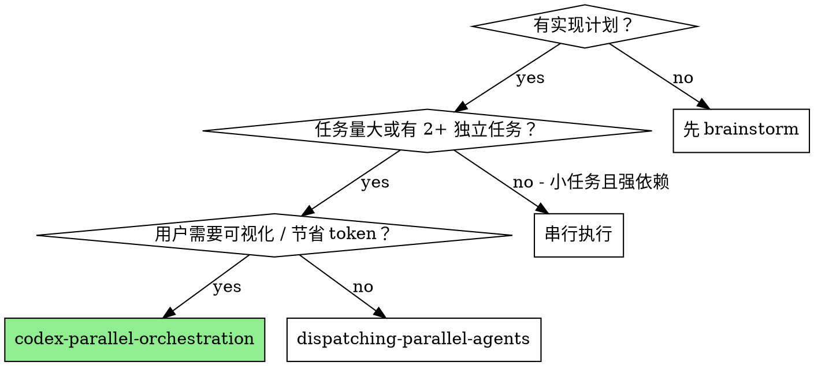

# Codex Orchestration

## Overview

通过 tmux 分屏 + 交互式 `codex` 在终端面板中执行实现任务。与 `dispatching-parallel-agents`（subagent 对用户不可见）不同，本 skill 让用户能**实时观察** AI 工作，并在需要时随时介入回答问题。同时将实现工作委托给 codex，**节省主会话 token**。

**核心原则：** 每个独立任务占一个 codex 面板，交互式运行，主 Claude 负责编排与整合。单个大任务也适用（1 个面板）。

## When to Use



**使用条件：**
- 有明确实现计划
- 满足以下任意一项：
  - 单个大任务（复杂度高、改动范围广），希望节省主会话 token
  - 2-4 个相互独立的任务，可并行执行
- 用户希望实时观察 AI 工作过程，或可能需要中途介入

**不使用条件：**
- 任务之间有强依赖（输出作为下一个的输入）且任务本身不大
- 用户不关心可视化且不在意 token 消耗（用 `dispatching-parallel-agents` 更简单）

## The Process

> **辅助脚本：** `scripts/` 目录下提供了自动化脚本，覆盖面板创建到清理的完整流程。**Claude 在调用前需确定 skill 目录的绝对路径**（通常为项目根目录下的 `.claude/skills/codex-parallel-orchestration`），避免相对路径在 cwd 不同时失败。
>
> | 脚本 | 用途 | 用法 |
> |------|------|------|
> | `scripts/codex-panel-create.sh` | Phase 1+2：创建面板 + 启动 codex + 等待就绪 | `bash SKILL_DIR/scripts/codex-panel-create.sh <主面板ID> <数量> [左侧宽度%]` |
> | `scripts/codex-send-task.sh` | Phase 3：发送任务 + 验证 + 重试 | `bash SKILL_DIR/scripts/codex-send-task.sh <面板ID> <<'EOF'` ... `EOF` |
> | `scripts/codex-check-status.sh` | Phase 4：批量检查面板状态 | `bash SKILL_DIR/scripts/codex-check-status.sh <面板ID1> [面板ID2] ...` |
> | `scripts/codex-cleanup.sh` | Phase 6：关闭 codex 面板 | `bash SKILL_DIR/scripts/codex-cleanup.sh <面板ID1> [面板ID2] ...` |

### Phase 0：确认目标窗口（必须先做）

在创建任何面板之前，先确认当前所在窗口，并询问用户希望在哪个窗口创建 codex 面板：

```bash
# 查看所有窗口和面板
tmux list-windows -a
tmux list-panes -a -F '#{session_name}:#{window_index}.#{pane_index} #{pane_id} #{pane_current_command}'
```

确认目标窗口后，列出该窗口现有面板，记录哪些是用户已有的（claude/zsh/ssh 等），绝对不操作已有面板。

### Phase 1+2：创建面板并启动 codex

**使用脚本（一步完成面板创建 + codex 启动 + 就绪检测）：**

```bash
# 确定 skill 目录绝对路径
SKILL_DIR="/path/to/project/.claude/skills/codex-parallel-orchestration"

# 创建 2 个 codex 面板，主面板占 40% 宽度
bash "$SKILL_DIR/scripts/codex-panel-create.sh" %0 2 40
# 单任务：创建 1 个面板，默认 50% 宽度
bash "$SKILL_DIR/scripts/codex-panel-create.sh" %0 1
```

脚本会自动：创建右侧面板 → 启动 codex → 轮询等待 `›` → 输出就绪/失败报告。

**布局原则：** 主 Claude 面板独占左侧，codex 面板在右侧竖向排列。不要在主 Claude 面板下方分屏。

```
┌──────────┬──────────┐
│          │ codex 1  │
│  主 Claude │──────────│
│  (不动)   │ codex 2  │
│          │──────────│
│          │ codex 3  │
└──────────┴──────────┘
```

### Phase 3：发送任务指令

**使用脚本（自动发送 + 验证 + 重试，通过 stdin heredoc 传入任务避免引号问题）：**

```bash
bash "$SKILL_DIR/scripts/codex-send-task.sh" %5 <<'EOF'
在 /path/to/project 中实现以下任务：
1. 需求描述...
2. 相关文件路径...
3. 不要动哪些文件...
4. 完成后运行 npx jest 验证
EOF
```

脚本使用 `tmux load-buffer` + `paste-buffer` 发送内容（绕过 `send-keys` 的引号解析），然后自动发 Enter → 验证 → 失败重试最多 3 次 → 报告结果。

**手动后备（脚本失败时）：** 分两步发送——先发内容，再单独发 Enter；发送后检查 codex 是否开始处理，最多重试 3 次，仍无响应则 `tmux kill-pane` 关闭，由主 Claude 完成该任务。

**任务描述要点：**
1. 项目/工作目录绝对路径
2. 完整需求描述（codex 可以读文件，但明确告知更快）
3. 明确的修改范围（不要动哪些文件）
4. **所有关联变更**（不只是主要替换，还要列出需要删除的无效 prop、需要更新的 import 等副作用）
5. 验证方式（运行哪些测试）

> **交互优势：** codex 运行中如需澄清会直接在面板输出问题，用户可随时切到该面板回答，codex 会继续执行。

### Phase 4：监控执行状态

```bash
# 使用脚本批量检查
bash "$SKILL_DIR/scripts/codex-check-status.sh" %5 %6 %7

# 或手动查看单个面板（注意：需过滤空行再取末尾，见技术注意事项）
tmux capture-pane -t %PANE_ID -p | grep -v '^[[:space:]]*$' | tail -3
```

用户可直接 `tmux attach` 观察所有面板，或在需要时切换到某个面板回答 codex 的问题。

**完成标志：** codex 输出完成摘要后，重新出现 `›` 提示符。

### Phase 5：收集结果并整合

所有面板完成后，Claude 读取 git diff 审查修改：

```bash
git diff --name-only   # 确认修改范围，检查是否有冲突
npx tsc --noEmit       # 类型检查
npx jest               # 测试套件
```

如有文件冲突，手动解决或派发修复 subagent。

### Phase 6：清理（必须执行）

所有任务完成后，**立即关闭**所有 codex 面板，不留残余：

```bash
# 使用脚本批量关闭
bash "$SKILL_DIR/scripts/codex-cleanup.sh" %5 %6 %7

# 或手动关闭（只关新建的，不要动用户原有面板）
tmux kill-pane -t %PANE_1
tmux kill-pane -t %PANE_2
```

## 技术注意事项

**codex UI 尾部空行问题**
codex 的 TUI 渲染会在 `›` 提示符下方留有大量空行。直接 `tmux capture-pane | tail -3` 会得到空结果，无法检测到 `›`。正确做法是先过滤空行再取末尾：
```bash
tmux capture-pane -t %PANE_ID -p | grep -v '^[[:space:]]*$' | tail -3
```
所有脚本已内置此处理，手动检查时也需注意。

**macOS bash 3.2 兼容性**
macOS 默认 bash 版本为 3.2，不支持负数组索引（如 `arr[-1]`）。脚本中统一使用 `arr[${#arr[@]}-1]` 替代，请勿在修改脚本时引入 bash 4+ 语法。

## Common Mistakes

**❌ 没有先确认目标窗口就创建面板**
直接 `tmux split-window` 会在当前活跃窗口创建，可能不是用户希望看到的窗口，也可能误操作用户已有的面板。应先 `tmux list-windows -a` 确认窗口结构，明确目标窗口后再操作。

**❌ 向用户已有的 Claude/进程面板发送命令**
创建面板前必须列出该窗口现有面板（`tmux list-panes -t <window>`），只向新建的空 zsh 面板发送 `codex`。

**❌ 使用相对路径调用脚本**
`bash .claude/skills/.../codex-panel-create.sh` 当 Claude 的 cwd 不是项目根目录时会找不到脚本。应先确定 skill 目录的**绝对路径**再调用。

**❌ 绕过脚本手动操作时未等待 `›`**
codex 需要几秒初始化。若不使用脚本手动操作，必须积极轮询（每 2-3 秒）确认出现 `›` 提示符后再发送任务。使用脚本则自动处理。

**❌ 绕过脚本手动发送任务后不验证**
发完 Enter 后必须立即检查 codex 是否开始处理。Enter 经常不生效，需重发。最多重试 3 次，仍无响应则关闭面板自己写。使用脚本则自动处理。

**❌ codex 卡住时死等不放弃**
codex 启动失败、Enter 不生效、或运行中报错卡死，重试 2-3 次后应果断 `tmux kill-pane` 关闭面板，由主 Claude 直接完成该任务。不要无限等待。

**❌ 手动 capture-pane 时未过滤空行**
codex UI 底部有大量空行，直接 `tail` 会返回空行而非 `›`，导致误判为未就绪。务必使用：
```bash
tmux capture-pane -t %PANE -p | grep -v '^[[:space:]]*$' | tail -3
```

**❌ 任务内容和 Enter 写在一条 send-keys 里**
```bash
# 错误：Enter 可能在多行内容缓冲区中提前提交
tmux send-keys -t %PANE "长任务描述..." Enter
```
```bash
# 正确：分两步，先内容后 Enter
tmux send-keys -t %PANE "长任务描述..."
tmux send-keys -t %PANE "" Enter
```

**❌ codex 提问时不回答就等它自动完成**
交互模式下 codex 提问后会等待回答，不会超时。需要用户切到面板手动回答，或 Claude 通过 tmux send-keys 代为回答。

**❌ 任务描述不包含项目路径**
codex 默认在 Claude 的 cwd 执行，描述中必须明确工作目录。

**❌ 任务之间有隐含依赖却并行**
任务 B 依赖任务 A 生成的类型定义 → 应串行。

**❌ 面板数量超过 4 个**
建议 1-4 个面板。面板太多用户无法观察，系统资源压力大；单个大任务用 1 个面板即可。

**❌ 任务完成后未关闭 codex 面板**
所有任务完成、结果验证后，必须立即 `tmux kill-pane` 关闭所有新建的 codex 面板，保持用户工作区整洁。只关自己新建的面板，不要动用户原有的面板。

**❌ 任务描述中遗漏关联变更**
例如替换 `TouchableOpacity` → `Pressable` 时，必须同时说明移除 `activeOpacity` prop；替换 import 时说明需要同步更新类型声明等。描述不完整会导致 TypeScript 报错需要额外修复轮次。

## Real Example

**场景 1（单任务）：** 大型重构任务，委托 codex 执行节省主会话 token

```
Panel 1: codex → "重构 database/ 层：拆分 migration 文件、添加 safeQuery 封装、简化 updateEntry..."
```

主 Claude 只需编排和验证结果，节省大量上下文 token。

**场景 2（并行）：** sync-status-redesign，Step 1 完成后并行执行 Step 2/3/4

```
Panel 1: codex → "实现 cloudSyncService 分批同步改造..."
Panel 2: codex → "实现 homeUploadSyncOrchestration 媒体事件接入..."
Panel 3: codex → "新增 showCloudSyncMonitor 入口服务..."
```

用户全程可见三个面板同时工作，任何一个 codex 提问都可以直接在面板里回答。

## 跨平台适配

本 skill 的所有操作均为 shell 命令（tmux + codex），**不依赖任何 Claude Code 特有工具**，可在 Codex CLI、Copilot CLI、Gemini CLI 等任意 agent CLI 中使用。

### 前置条件

- `tmux` 已安装（macOS: `brew install tmux`，Linux: 包管理器安装）
- `codex` CLI 已安装（`npm i -g @openai/codex`）
- **Agent 运行在 tmux 会话内**（或可创建/连接到 tmux 会话）

### 工具映射

本 skill 仅依赖运行 shell 命令这一个能力：

| 操作 | Claude Code | Codex CLI | Copilot CLI | Gemini CLI |
|------|-------------|-----------|-------------|------------|
| 运行 shell 命令 | `Bash` | 原生 shell 工具 | `bash` | `run_shell_command` |

### Skill 目录路径解析

- **Claude Code**：自动发现，脚本在 `.claude/skills/codex-orchestration/scripts/`
- **其他 CLI**：通过 `npx openskills read codex-orchestration` 加载时输出的 base directory 拼接 `scripts/` 路径，赋值给 `SKILL_DIR`

### 兼容性说明

| 平台 | 兼容性 | 说明 |
|------|--------|------|
| Claude Code | ✅ 完全兼容 | 原生支持 |
| Codex CLI | ✅ 完全兼容 | 仅需 shell 工具 |
| Copilot CLI | ✅ 完全兼容 | 使用 `bash` 工具 |
| Gemini CLI | ✅ 完全兼容 | 使用 `run_shell_command`；虽无子 agent 支持，但本 skill 不需要 |

## 与其他 Skill 的关系

- **前置**：`brainstorming` → `writing-plans` → 本 skill
- **替代（不可见）**：`dispatching-parallel-agents` — 更简单，但用户看不到过程
- **替代（同会话）**：`subagent-driven-development` — 串行执行，有两阶段 review
- **后续**：`finishing-a-development-branch`
