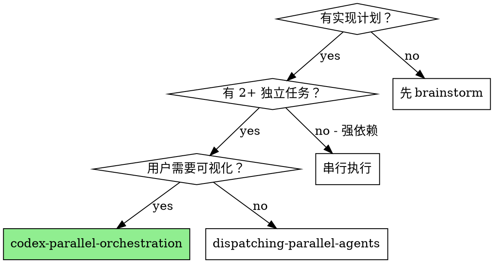

# Codex Parallel Orchestration

## Overview

通过 tmux 分屏 + 交互式 `codex` 在多个终端面板中并行执行独立实现任务。与 `dispatching-parallel-agents`（subagent 对用户不可见）不同，本 skill 让用户能**实时观察**多个 AI 同时工作，并在需要时随时介入回答问题。

**核心原则：** 每个独立任务占一个 codex 面板，交互式运行，主 Claude 负责编排与整合。

## When to Use



**使用条件：**
- 有明确实现计划，任务相互独立
- 用户希望实时观察 AI 工作过程，或可能需要中途介入
- 需要 2-4 个并行任务（更多会导致面板混乱）

**不使用条件：**
- 任务之间有强依赖（输出作为下一个的输入）
- 只有 1 个任务
- 用户不关心可视化（用 `dispatching-parallel-agents` 更简单）

## The Process

### Phase 0：确认目标窗口（必须先做）

在创建任何面板之前，先确认当前所在窗口，并询问用户希望在哪个窗口创建 codex 面板：

```bash
# 查看所有窗口和面板
tmux list-windows -a
tmux list-panes -a -F '#{session_name}:#{window_index}.#{pane_index} #{pane_id} #{pane_current_command}'
```

确认目标窗口后，列出该窗口现有面板，记录哪些是用户已有的（claude/zsh/ssh 等），绝对不操作已有面板。

### Phase 1：创建 tmux 面板

```bash
# 在目标窗口创建 N 个面板（均匀平铺）
tmux split-window -t <session>:<window> -v
tmux split-window -t <session>:<window> -v  # 重复直到 N 个面板
tmux select-layout -t <session>:<window> tiled

# 确认新面板 ID
tmux list-panes -t <session>:<window> -F '#{pane_index}: #{pane_id}'
```

### Phase 2：在每个面板启动交互式 codex

```bash
# 在每个面板启动 codex（交互模式）
tmux send-keys -t %PANE_ID "codex" Enter
```

**等待就绪（必须）：** codex 启动需要几秒初始化。发任务前必须确认 `›` 提示符已出现：

```bash
# 轮询直到就绪（›  符号出现在末行）
tmux capture-pane -t %PANE_ID -p | tail -3
# 未就绪：显示加载信息或空白
# 已就绪：末行显示 ›
```

未就绪就发任务会导致内容被当成 shell 命令执行而非 codex 输入。

### Phase 3：发送任务指令

codex 出现 `›` 后，发送任务描述。**关键：长文本必须分两步——先发内容，再单独发 Enter：**

```bash
# 第一步：发送任务内容（不带 Enter）
tmux send-keys -t %PANE_ID "在 /path/to/project 中实现以下任务：

1. 需求描述（完整）
2. 相关文件路径
3. 修改范围（不要动哪些文件）
4. 完成后运行 npx jest --testPathPattern=xxx 验证"

# 第二步：单独发 Enter 提交（必须分开！）
tmux send-keys -t %PANE_ID "" Enter
```

> **为什么要分两步？** `tmux send-keys "内容" Enter` 中的 Enter 会紧接内容末尾发送，在 codex 的多行输入缓冲区中可能提前提交不完整的内容。分开发送更可靠。

**任务描述要点：**
1. 项目/工作目录绝对路径
2. 完整需求描述（codex 可以读文件，但明确告知更快）
3. 明确的修改范围（不要动哪些文件）
4. **所有关联变更**（不只是主要替换，还要列出需要删除的无效 prop、需要更新的 import 等副作用）
5. 验证方式（运行哪些测试）

> **交互优势：** codex 运行中如需澄清会直接在面板输出问题，用户可随时切到该面板回答，codex 会继续执行。

### Phase 4：监控执行状态

```bash
# 查看各面板当前状态
tmux capture-pane -t %PANE_ID -p | tail -10
```

用户可直接 `tmux attach` 观察所有面板，或在需要时切换到某个面板回答 codex 的问题。

**完成标志：** codex 输出完成摘要后，重新出现 `›` 提示符。

### Phase 5：收集结果并整合

所有面板完成后，Claude 读取 git diff 审查修改：

```bash
git diff --name-only   # 确认修改范围，检查是否有冲突
npx tsc --noEmit       # 类型检查
npx jest               # 测试套件
```

如有文件冲突，手动解决或派发修复 subagent。

### Phase 6：清理（必须执行）

所有任务完成后，**立即关闭**所有 codex 面板，不留残余：

```bash
# 关闭所有 codex 面板（只关新建的，不要动用户原有面板）
tmux kill-pane -t %PANE_1
tmux kill-pane -t %PANE_2
# ...
```

## Common Mistakes

**❌ 没有先确认目标窗口就创建面板**
直接 `tmux split-window` 会在当前活跃窗口创建，可能不是用户希望看到的窗口，也可能误操作用户已有的面板。应先 `tmux list-windows -a` 确认窗口结构，明确目标窗口后再操作。

**❌ 向用户已有的 Claude/进程面板发送命令**
创建面板前必须列出该窗口现有面板（`tmux list-panes -t <window>`），只向新建的空 zsh 面板发送 `codex`。

**❌ 面板刚创建就发送任务**
codex 需要几秒初始化。应先轮询确认出现 `›` 提示符，再发送任务。

**❌ 任务内容和 Enter 写在一条 send-keys 里**
```bash
# 错误：Enter 可能在多行内容缓冲区中提前提交
tmux send-keys -t %PANE "长任务描述..." Enter
```
```bash
# 正确：分两步，先内容后 Enter
tmux send-keys -t %PANE "长任务描述..."
tmux send-keys -t %PANE "" Enter
```

**❌ codex 提问时不回答就等它自动完成**
交互模式下 codex 提问后会等待回答，不会超时。需要用户切到面板手动回答，或 Claude 通过 tmux send-keys 代为回答。

**❌ 任务描述不包含项目路径**
codex 默认在 Claude 的 cwd 执行，描述中必须明确工作目录。

**❌ 任务之间有隐含依赖却并行**
任务 B 依赖任务 A 生成的类型定义 → 应串行。

**❌ 超过 4 个并行面板**
面板太多，用户无法观察，系统资源压力大。

**❌ 任务完成后未关闭 codex 面板**
所有任务完成、结果验证后，必须立即 `tmux kill-pane` 关闭所有新建的 codex 面板，保持用户工作区整洁。只关自己新建的面板，不要动用户原有的面板。

**❌ 任务描述中遗漏关联变更**
例如替换 `TouchableOpacity` → `Pressable` 时，必须同时说明移除 `activeOpacity` prop；替换 import 时说明需要同步更新类型声明等。描述不完整会导致 TypeScript 报错需要额外修复轮次。

## Real Example

**场景：** sync-status-redesign，Step 1 完成后并行执行 Step 2/3/4

```
Panel 1: codex → "实现 cloudSyncService 分批同步改造..."
Panel 2: codex → "实现 homeUploadSyncOrchestration 媒体事件接入..."
Panel 3: codex → "新增 showCloudSyncMonitor 入口服务..."
```

用户全程可见三个面板同时工作，任何一个 codex 提问都可以直接在面板里回答。

## 与其他 Skill 的关系

- **前置**：`brainstorming` → `writing-plans` → 本 skill
- **替代（不可见）**：`dispatching-parallel-agents` — 更简单，但用户看不到过程
- **替代（同会话）**：`subagent-driven-development` — 串行执行，有两阶段 review
- **后续**：`finishing-a-development-branch`
