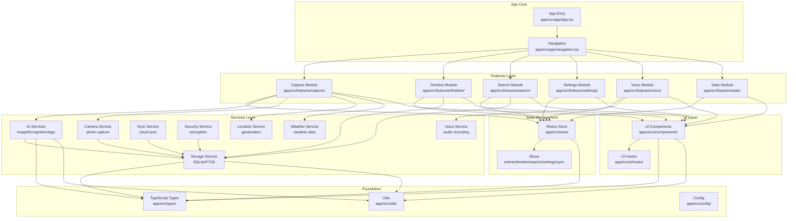

<!-- OPENSPEC:START -->
# OpenSpec Instructions

These instructions are for AI assistants working in this project.

Always open `@/openspec/AGENTS.md` when the request:
- Mentions planning or proposals (words like proposal, spec, change, plan)
- Introduces new capabilities, breaking changes, architecture shifts, or big performance/security work
- Sounds ambiguous and you need the authoritative spec before coding

Use `@/openspec/AGENTS.md` to learn:
- How to create and apply change proposals
- Spec format and conventions
- Project structure and guidelines

Keep this managed block so 'openspec update' can refresh the instructions.

<!-- OPENSPEC:END -->

# CLAUDE.md

This file provides guidance to Claude Code (claude.ai/code) when working with code in this repository.

## Project Overview

**MemoryCapsule** is a powerful React Native life-logging application with multi-modal recording (photo, voice, text), timeline review, intelligent search, and AI-powered features.

### Quick Info
- **Framework**: React Native 0.74 + TypeScript 5.x
- **State**: Redux Toolkit
- **Database**: SQLite + FTS5
- **All commands run in `app/` directory**

## Project Architecture



### Module Hierarchy

```
MemoryCapsule/
├── app/                          # React Native 应用主目录
│   ├── src/
│   │   ├── app/                  # 应用入口和导航
│   │   │   └── [App.tsx, navigation.tsx]
│   │   ├── features/             # 功能模块(按业务领域划分)
│   │   │   ├── capture/          # [拍照记录] 多模态数据捕获
│   │   │   ├── timeline/         # [时间线] 时间轴展示
│   │   │   ├── search/           # [搜索] FTS5全文搜索
│   │   │   ├── settings/         # [设置] 应用配置
│   │   │   ├── voice/            # [语音] 语音记录
│   │   │   └── stats/            # [统计] 数据统计
│   │   ├── services/             # 服务层(技术能力)
│   │   │   ├── ai/               # AI服务(图像识别/标签)
│   │   │   ├── camera/           # 相机服务
│   │   │   ├── storage/          # 存储服务(SQLite)
│   │   │   ├── sync/             # 同步服务
│   │   │   ├── security/         # 安全加密
│   │   │   ├── location/         # 位置服务
│   │   │   ├── weather/          # 天气服务
│   │   │   └── voice/            # 语音服务
│   │   ├── store/                # Redux全局状态
│   │   │   └── slices/           # 各模块的slice
│   │   ├── ui/                   # UI基础设施
│   │   │   ├── components/       # 通用组件
│   │   │   └── hooks/            # 通用Hooks
│   │   ├── types/                # TypeScript类型定义
│   │   ├── utils/                # 工具函数
│   │   └── config/               # 配置文件
│   └── [package.json, tsconfig.json, ...]
└── agent_docs/                   # AI助手文档模块
```

> 💡 **导航提示**: 每个模块都有本地 `CLAUDE.md` 文档,提供详细的接口、依赖和实现说明。

## MCP Tools

The project includes Model Context Protocol (MCP) tools for enhanced development capabilities.

### When to Use

| Task | Tool | Example |
|------|------|---------|
| **Understand code** | `serena` | Find components, search patterns |
| **Get docs** | `context7` | React hooks, library APIs |
| **Mobile testing** | `mobile-mcp` | Screenshot, tap, swipe |
| **Research** | `MiniMax` | Web search, latest practices |
| **Analyze image** | `MiniMax` | UI issues, error screenshots |
| **Complex problem** | `sequential-thinking` | Architecture decisions |

**Quick reference**: [MCP Tools Guide](agent_docs/00-mcp-tools.md)

## Documentation Modules

For detailed information, refer to the modular documentation in the `agent_docs/` directory:

| Document | Description |
|----------|-------------|
| [00-mcp-tools.md](agent_docs/00-mcp-tools.md) | MCP tools usage guide and best practices |
| [01-architecture.md](agent_docs/01-architecture.md) | Architecture overview, tech stack, patterns |
| [02-module-index.md](agent_docs/02-module-index.md) | Module structure and visual diagrams |
| [03-setup-build.md](agent_docs/03-setup-build.md) | Environment setup and build commands |
| [04-coding-standards.md](agent_docs/04-coding-standards.md) | Coding conventions, TypeScript, path aliases |
| [05-testing-strategy.md](agent_docs/05-testing-strategy.md) | Testing approach and guidelines |
| [06-ai-services.md](agent_docs/06-ai-services.md) | AI service configuration and usage |
| [07-security-privacy.md](agent_docs/07-security-privacy.md) | Security policies and permissions |
| [08-directory-structure.md](agent_docs/08-directory-structure.md) | File structure and key locations |
| [09-spec-workflow.md](agent_docs/09-spec-workflow.md) | Specification-driven development process |
| [10-faq.md](agent_docs/10-faq.md) | Troubleshooting and common issues |
| [11-changelog.md](agent_docs/11-changelog.md) | Version history and updates |

## Quick Start

```bash
cd app
npm install
npm start
npm run ios  # or android
```

## Key Points

- **All commands in `app/` directory**
- **Use path aliases** (`@store/hooks`, `@ui/components`)
- **Performance**: All core operations < 2s, memory < 150MB
- **Testing**: 70% coverage minimum, run `npm test`
- **Security**: AES-256-GCM encryption, offline-first
