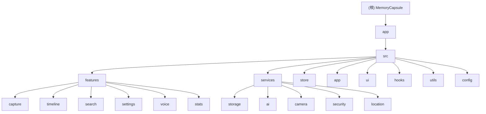

<!-- OPENSPEC:START -->
# OpenSpec Instructions

These instructions are for AI assistants working in this project.

Always open `@/openspec/AGENTS.md` when the request:
- Mentions planning or proposals (words like proposal, spec, change, plan)
- Introduces new capabilities, breaking changes, architecture shifts, or big performance/security work
- Sounds ambiguous and you need the authoritative spec before coding

Use `@/openspec/AGENTS.md` to learn:
- How to create and apply change proposals
- Spec format and conventions
- Project structure and guidelines

Keep this managed block so 'openspec update' can refresh the instructions.

<!-- OPENSPEC:END -->

# CLAUDE.md

This file provides guidance to Claude Code (claude.ai/code) when working with code in this repository.

# MemoryCapsule AI 项目上下文文档

## 项目愿景

MemoryCapsule 是一个功能强大的React Native生活记录应用，支持拍照、语音、文字多模态记录，具备时间线回顾、智能搜索、AI标签建议等功能。项目采用TypeScript + Redux Toolkit架构，使用SQLite本地存储，注重性能和隐私保护。

## 架构总览

### 技术栈
- **框架**: React Native 0.74 + TypeScript 5.x
- **状态管理**: Redux Toolkit
- **导航**: React Navigation 6
- **数据库**: SQLite (react-native-sqlite-storage) + FTS5 全文搜索
- **UI 库**: React Native Paper
- **加密**: AES-256-GCM
- **语音转写**: 腾讯云 ASR
- **图像识别**: 百度 EasyDL TensorFlow Lite
- **测试**: Jest + React Native Testing Library + Detox (E2E)

### 核心架构模式
- **功能驱动架构**: 按业务领域组织代码（capture、timeline、search、settings等）
- **分层架构**: Features → Services → Store → UI
- **离线优先**: 本地存储为主，云端同步为辅
- **性能优先**: 虚拟滚动、懒加载、内存优化

## 模块结构图



## 模块索引

| 模块 | 路径 | 职责 | 入口文件 | 测试覆盖率 |
|------|------|------|----------|------------|
| capture | `app/src/features/capture/` | 记录创建（拍照、文字、语音） | `HomeScreen.tsx` | 80% |
| timeline | `app/src/features/timeline/` | 时间线回顾与视图切换 | `TimelineScreen.tsx` | 75% |
| search | `app/src/features/search/` | 搜索与筛选功能 | `SearchScreen.tsx` | 70% |
| settings | `app/src/features/settings/` | 应用设置与安全管理 | `SettingsScreen.tsx` | 85% |
| voice | `app/src/features/voice/` | 语音录制与转写 | `VoiceRecordScreen.tsx` | 75% |
| stats | `app/src/features/stats/` | 数据统计与可视化 | `StatsScreen.tsx` | 65% |

## 运行与开发

### 环境要求
- Node.js 18+
- React Native 0.74
- iOS 15+ / Android 12+
- Xcode（iOS开发）和 Android Studio

### 快速启动

⚠️ **重要**: 所有命令需要在 `app/` 目录下执行

```bash
# 1. 切换到app目录
cd app

# 2. 安装依赖
npm install

# 3. 安装iOS依赖（仅macOS，需要在app目录下）
cd ios && bundle install && bundle exec pod install && cd ..

# 4. 启动开发服务器（Metro bundler）
npm start

# 5. 运行应用（新终端窗口）
npm run ios          # iOS模拟器
npm run android      # Android模拟器
```

### 常用命令

所有命令都在 `app/` 目录下执行：

```bash
# 开发服务器
npm start            # 启动Metro bundler
npm start -- --reset-cache  # 重置Metro缓存

# 运行应用
npm run ios          # iOS模拟器
npm run android      # Android模拟器

# 代码质量
npm run lint         # ESLint检查
npm run lint:fix     # 自动修复ESLint问题
npm run format       # Prettier格式化所有代码
npm run typecheck    # TypeScript类型检查（不编译）

# 测试
npm test             # 单元测试
npm test -- <file>   # 运行特定测试文件
npm run test:watch   # 监听模式测试
npm run test:coverage # 生成覆盖率报告

# E2E测试
npm run test:e2e:build:ios    # 构建iOS测试版本
npm run test:e2e:build:android # 构建Android测试版本
npm run test:e2e:ios          # 运行iOS E2E测试
npm run test:e2e:android      # 运行Android E2E测试

# iOS依赖管理
npm run pod         # 安装CocoaPods依赖（替代手动pod install）

# 清理
# 删除node_modules和重新安装
rm -rf node_modules package-lock.json && npm install
# iOS专用清理
cd ios && rm -rf Pods Podfile.lock && bundle exec pod install && cd ..
```

## Spec Workflow 开发流程

项目采用规范驱动的开发流程（Spec-driven Development），所有新功能都需要先创建规范文档：

### 规范目录结构
- `specs/`: 功能需求规范和任务文档
- `.spec-workflow/`: 规范工作流工具和脚本

### 开发流程
1. **创建规范**: 在 `specs/` 目录下创建新的功能规范文档
2. **任务分解**: 将规范分解为具体的开发任务
3. **实现**: 按照任务列表逐步实现功能
4. **评审**: 提交代码前需要通过规范检查

### 当前活跃规范
- `specs/001-lifelog-capture/`: 生活记录功能规范

## 关键开发注意事项

### TypeScript配置
- **严格模式**: 已关闭 (`strict: false`)
- **类型检查**: 使用 `npm run typecheck` 进行类型验证
- **路径别名**: 项目配置了完整的路径别名系统（见下方）

### 路径别名系统
项目广泛使用路径别名，导入时优先使用别名而非相对路径：

```typescript
// ✅ 推荐 - 使用路径别名
import { useAppSelector } from '@store/hooks'
import { EntryCard } from '@ui/components/EntryCard'

// ❌ 不推荐 - 相对路径
import { useAppSelector } from '../../store/hooks'
```

### 架构模式
- **功能优先 (Feature-first)**: 按业务领域组织代码
- **分层架构**: Features → Services → Store → UI
- **关注点分离**: 业务逻辑与UI组件分离
- **Redux Toolkit**: 用于全局状态管理

### 性能优化要求
- **关键指标**: 所有核心操作响应时间 < 2秒
- **列表优化**: 时间线使用虚拟滚动 ( FlatList 的 `getItemLayout` 和 `removeClippedSubviews`)
- **渲染优化**: 组件使用 `React.memo()`，避免不必要的重渲染
- **内存管理**: 定期清理缓存，监控内存使用 < 150MB

## 测试策略

### 单元测试
- **覆盖率要求**: 分支、函数、行、语句 ≥ 70%
- **测试框架**: Jest + React Native Testing Library
- **重点测试**: 用户交互逻辑、业务逻辑、状态管理

### E2E测试
- **测试框架**: Detox
- **覆盖场景**: 核心用户流程（拍照、录音、搜索、时间线浏览）
- **性能验证**: 响应时间 < 2秒

### Mock策略
项目配置了完整的第三方库Mock：
- React Native相关库（相机、文件系统、权限等）
- UI库（React Native Paper、图标库等）
- 状态管理（Redux Toolkit）

## 编码规范

### 路径别名配置

在 `tsconfig.json` 中配置的路径别名，**强烈建议**在导入时使用：

```typescript
@/              → app/src/
@features/      → app/src/features/
@services/      → app/src/services/
@store/         → app/src/store/
@store/*        → app/src/store/*
@ui/            → app/src/ui/
@ui/*           → app/src/ui/*
@hooks/*        → app/src/hooks/*
@utils/*        → app/src/utils/*
@app/*          → app/src/app/*
@config/*       → app/src/config/*
```

**注意**:
- 路径别名从 `app/` 目录开始解析
- 使用别名可以避免复杂的相对路径导入
- 有助于代码重构和模块移动

### 组件开发模式
- 每个功能模块包含 `components/`、`screens/`、`hooks/` 子目录
- 组件使用 TypeScript + React.memo() 优化性能
- 自定义 Hooks 复用业务逻辑
- 所有组件都有对应的测试文件

### 数据流设计
- Redux Toolkit 管理全局状态
- 本地状态使用 useState + useEffect
- 数据持久化通过 SQLite + AsyncStorage
- 实时数据更新通过 Redux 中间件

### 性能要求
- 应用启动 < 2秒
- 搜索响应 < 2秒
- 视图切换 < 2秒
- 内存占用 < 150MB
- 帧率 > 55fps

## AI 使用指引

### AI服务配置

**语音转写服务**
- **提供商**: 腾讯云 ASR (语音识别)
- **配置文件**: `src/config/tencentCloud.ts`
- **配置项**: 需要配置腾讯云 SecretId 和 SecretKey
- **支持语言**: 中文、英文等多语言，自动语言检测

**图像识别服务**
- **提供商**: 百度 EasyDL TensorFlow Lite
- **模型文件**: 需要下载并放置在指定目录
- **功能**: 自动标签建议、图像内容识别

**语义搜索**
- **实现**: 本地向量匹配算法
- **数据库**: SQLite FTS5 全文搜索 + 语义向量匹配
- **性能**: 搜索响应 < 2秒

### AI功能集成位置
- **语音转写**: `src/services/speechToText/`
- **图像识别**: `src/services/ai/`
- **语义搜索**: `src/services/ai/semanticSearch.ts`
- **配置**: `src/config/tencentCloud.ts`

### 离线优先原则
- 所有AI处理优先本地执行
- 网络不可用时缓存数据，待网络恢复后处理
- 敏感数据不会自动上传到云端

## 安全与隐私

### 数据保护
- 所有本地数据使用AES-256-GCM加密
- 支持生物识别和密码双重认证
- 离线优先，减少网络传输
- 定期密钥轮换策略

### 权限管理
- 📷 相机权限 - 用于拍照
- 🖼️ 相册权限 - 用于选择照片
- 🎤 麦克风权限 - 用于语音录制
- 📍 位置权限 - 用于记录地点
- 📅 日历权限 - 用于日期提醒

## 核心目录和文件

### 主要源代码目录
```
app/src/
├── features/           # 功能模块（按业务领域组织）
│   ├── capture/        # 记录创建（拍照、录音、文字）
│   ├── timeline/       # 时间线回顾与视图
│   ├── search/         # 搜索与筛选
│   ├── settings/       # 应用设置
│   ├── voice/          # 语音录制与转写
│   └── stats/          # 数据统计
├── services/           # 业务服务层
│   ├── storage/        # SQLite数据库操作
│   ├── ai/             # AI功能（图像识别、语义搜索）
│   ├── speechToText/   # 语音转写服务
│   ├── camera/         # 相机服务
│   └── security/       # 加密与安全
├── store/              # Redux状态管理
│   ├── slices/         # Redux Toolkit slices
│   ├── hooks.ts        # 预定义的useSelector/useDispatch hooks
│   └── index.ts        # Store配置
├── ui/                 # 通用UI组件
├── app/                # 应用配置
├── config/             # 配置文件
└── types/              # TypeScript类型定义
```

### 关键文件位置
- **数据库模式**: `src/services/storage/database.ts`
- **Redux Store配置**: `src/store/index.ts`
- **应用入口**: `app/App.tsx`
- **导航配置**: `src/app/navigation.tsx`
- **主题配置**: `src/app/theme.ts`
- **类型定义**: `src/types/declarations.d.ts`

## 关键配置文件

| 文件 | 用途 |
|------|------|
| `package.json` | 依赖和脚本配置 |
| `tsconfig.json` | TypeScript和路径别名配置 |
| `jest.config.js` | 测试配置和Mock设置 |
| `babel.config.js` | Babel转换配置 |
| `metro.config.js` | Metro打包配置 |
| `app.json` | React Native应用配置 |

## 常见问题

### Q: 如何添加新的记录类型？
A:
1. 在 `features/capture/` 中添加新的组件和屏幕
2. 更新 `src/services/storage/database.ts` 中的数据模型和表结构
3. 在 `src/store/slices/` 中添加相应的 Redux slice
4. 更新类型定义文件 `src/types/declarations.d.ts`

### Q: 如何配置AI服务？
A:
1. **腾讯云ASR**: 编辑 `src/config/tencentCloud.ts`，填入 SecretId 和 SecretKey
2. **百度EasyDL**: 下载 TensorFlow Lite 模型文件，放置到 `src/assets/models/` 目录
3. 测试配置: 运行 `npm run typecheck` 确保配置正确

### Q: 应用无法启动，如何排查？
A:
1. 检查 Metro 缓存: `npm start -- --reset-cache`
2. 检查依赖: `cd ios && bundle exec pod install && cd ..`
3. 检查设备模拟器: 确保 iOS/Android 模拟器正常运行
4. 查看日志: Metro bundler 控制台输出的错误信息

### Q: 如何优化性能？
A:
1. 使用 `React.memo()` 包装组件，避免不必要重渲染
2. 长列表使用虚拟滚动 (`FlatList` + `getItemLayout`)
3. 数据库查询启用索引，优化SQLite性能
4. 图片使用缓存和压缩
5. 使用 `useMemo` 和 `useCallback` 缓存计算结果

### Q: 测试失败如何处理？
A:
1. 运行特定测试: `npm test -- --testNamePattern="test name"`
2. 更新快照: `npm test -- -u`
3. 检查 Mock 配置: `jest.config.js` 中的 mock 设置
4. 清理测试缓存: `npm test -- --clearCache`

### Q: iOS构建失败怎么办？
A:
1. 更新 CocoaPods: `cd ios && bundle exec pod install --repo-update`
2. 清理构建缓存: `cd ios && xcodebuild clean`
3. 检查证书配置: 确保 Xcode 中 Apple Developer 账户配置正确
4. 查看详细错误: `cd ios && xcodebuild -list`

## 变更记录 (Changelog)

### 2025-12-11 00:36
- 添加CLAUDE.md标准前缀，符合claude.ai/code规范
- 明确工作目录要求：所有命令需在`app/`目录下执行
- 扩展常用命令列表，添加清理、缓存重置、单个测试运行等实用命令
- 新增"Spec Workflow 开发流程"章节，详细说明规范驱动开发流程
- 完善"关键开发注意事项"，强调TypeScript配置、路径别名、架构模式和性能优化
- 改进"AI 使用指引"，明确服务配置、文件路径和离线优先原则
- 大幅扩展"常见问题"部分，添加6个实用问答覆盖启动、配置、性能、测试和iOS构建问题

### 2025-11-03 05:40:04
- 完成项目AI上下文初始化
- 生成根级CLAUDE.md文档
- 创建模块级文档结构
- 建立Mermaid架构图
- 更新项目索引和覆盖率统计