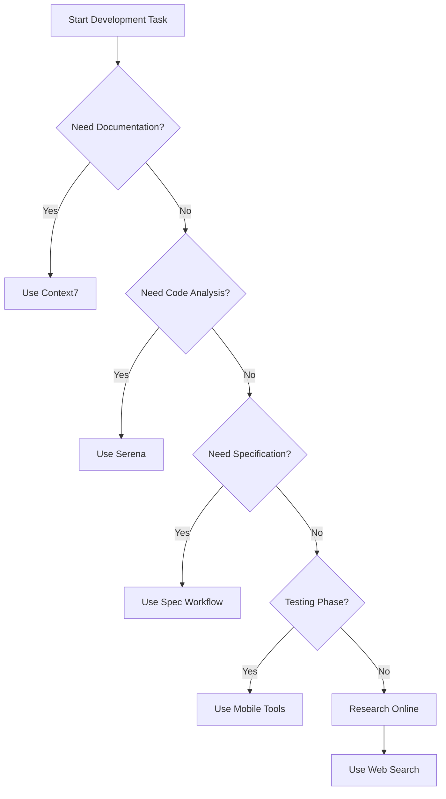

# MCP Tools Guide

## What are MCP Tools?

MCP (Model Context Protocol) tools provide additional capabilities for AI assistants to interact with external systems, retrieve information, and perform specialized tasks.

## Available MCP Tools

### 1. Context7 - Library Documentation
Retrieves up-to-date documentation and code examples for any library.

**Key Functions:**
- `resolve_library_id` - Find the correct library ID for documentation
- `get_library_docs` - Retrieve library documentation in code or info mode

**Usage Example:**
```bash
# Get documentation for React
# First resolve the library ID
mcp__context7__resolve_library_id({"libraryName": "react"})

# Then get the documentation
mcp__context7__get_library_docs({
  "context7CompatibleLibraryID": "/facebook/react",
  "mode": "code",
  "topic": "hooks"
})
```

**Use Cases:**
- Retrieve React hooks documentation
- Get TypeScript best practices
- Find library API references
- Study code examples

### 2. Serena - Semantic Coding Agent
Professional coding agent with semantic coding tools for efficient code analysis and manipulation.

**Key Functions:**
- `find_symbol` - Search for symbols (classes, methods, functions)
- `get_symbols_overview` - Get overview of symbols in a file
- `find_referencing_symbols` - Find references to a symbol
- `replace_symbol_body` - Replace symbol definitions
- `list_dir` - List directory contents
- `search_for_pattern` - Pattern search in codebase

**Usage Example:**
```bash
# Find all components in a feature
mcp__serena__find_symbol({
  "name_path_pattern": "components",
  "relative_path": "app/src/features/capture",
  "include_kinds": [5],  # Class kind
  "depth": 1
})

# Get file overview
mcp__serena__get_symbols_overview({
  "relative_path": "app/src/features/timeline/TimelineScreen.tsx",
  "depth": 2
})

# Search for patterns
mcp__serena__search_for_pattern({
  "substring_pattern": "useAppSelector",
  "relative_path": "app/src"
})
```

**Use Cases:**
- Understand codebase structure
- Find implementation patterns
- Refactor code safely
- Analyze dependencies
- Track down bugs

### 3. Spec Workflow - Specification Management
Tools for managing specification-driven development workflow.

**Key Functions:**
- `spec_workflow_guide` - Load spec workflow instructions
- `spec_status` - Check specification progress
- `approvals` - Manage approval requests
- `log_implementation` - Record implementation details

**Usage Example:**
```bash
# Load spec workflow guide
mcp__spec_workflow__spec_workflow_guide({})

# Check spec status
mcp__spec_workflow__spec_status({
  "specName": "001-lifelog-capture"
})

# Request approval
mcp__spec_workflow__approvals({
  "action": "request",
  "type": "document",
  "filePath": "specs/001-lifelog-capture/spec.md",
  "title": "Life Log Capture Specification"
})
```

**Use Cases:**
- Track feature specifications
- Manage development workflow
- Request code reviews
- Document implementations

### 4. Mobile Device Control
Control and interact with mobile devices (iOS/Android simulators and physical devices).

**Key Functions:**
- `list_available_devices` - List all devices
- `launch_app` - Open app on device
- `take_screenshot` - Capture device screen
- `click_on_screen_at_coordinates` - Simulate touch
- `swipe_on_screen` - Simulate swipe gestures
- `type_keys` - Input text

**Usage Example:**
```bash
# List available devices
mcp__mobile-mcp__mobile_list_available_devices({})

# Take screenshot
mcp__mobile-mcp__mobile_take_screenshot({
  "device": "ios-simulator",
  "saveTo": "screenshots/app_state.png"
})

# Tap at coordinates
mcp__mobile-mcp__mobile_click_on_screen_at_coordinates({
  "device": "ios-simulator",
  "x": 100,
  "y": 200
})
```

**Use Cases:**
- Automated testing
- UI interaction testing
- Device compatibility checks
- Screenshot capture for documentation

### 5. Web Search Tools
Search the web for current information and fetch content from websites.

**Key Functions:**
- `web_search` - Search using multiple engines (DuckDuckGo, Bing, Brave)
- `fetchGithubReadme` - Get GitHub repository README
- `fetchJuejinArticle` - Fetch Chinese tech article
- `fetchLinuxDoArticle` - Fetch Linux documentation

**Usage Example:**
```bash
# Web search
mcp__open-websearch__search({
  "query": "React Native performance optimization 2025",
  "engines": ["duckduckgo", "bing"],
  "limit": 10
})

# Fetch GitHub README
mcp__open-websearch__fetchGithubReadme({
  "url": "https://github.com/facebook/react-native"
})
```

**Use Cases:**
- Research latest practices
- Find solutions to problems
- Get current documentation
- Study open source projects

## Best Practices

### When to Use MCP Tools

1. **Context7**: When you need documentation for libraries or frameworks
2. **Serena**: For code exploration, refactoring, and understanding architecture
3. **Spec Workflow**: For specification-driven development and tracking
4. **Mobile Control**: For automated testing and UI validation
5. **Web Search**: For research and finding current information

### Integration with Development Workflow



### Common Patterns

1. **Code Understanding**:
   - Start with `get_symbols_overview` to understand file structure
   - Use `find_symbol` to locate specific components
   - Use `find_referencing_symbols` to understand dependencies

2. **Documentation Lookup**:
   - Use `resolve_library_id` first to get correct ID
   - Then use `get_library_docs` with specific topic
   - Combine with code examples for better understanding

3. **Testing**:
   - Use `list_available_devices` to check available devices
   - Take screenshots to document current state
   - Use coordinate-based interactions for automation

4. **Research**:
   - Use web search for current best practices
   - Fetch official documentation from GitHub
   - Cross-reference multiple sources

## Error Handling

- Always check if tools are available before using them
- Handle errors gracefully and provide fallbacks
- Cache results when possible to improve performance
- Use appropriate tools for specific tasks

## Performance Tips

- Use specific search patterns to reduce results
- Limit the scope of searches to relevant directories
- Cache frequently accessed information
- Combine multiple tools for comprehensive analysis
