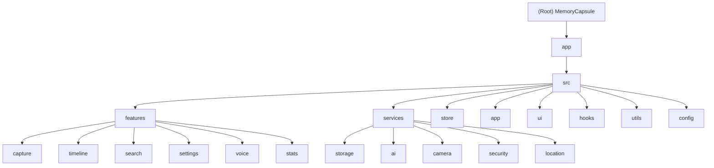

# Module Index

## Module Structure Diagram

## Module Index

| Module | Path | Responsibility | Entry File | Test Coverage |
|--------|------|----------------|------------|---------------|
| capture | `app/src/features/capture/` | Record creation (photo, text, voice) | `HomeScreen.tsx` | 80% |
| timeline | `app/src/features/timeline/` | Timeline review and view switching | `TimelineScreen.tsx` | 75% |
| search | `app/src/features/search/` | Search and filtering | `SearchScreen.tsx` | 70% |
| settings | `app/src/features/settings/` | App settings and security management | `SettingsScreen.tsx` | 85% |
| voice | `app/src/features/voice/` | Voice recording and transcription | `VoiceRecordScreen.tsx` | 75% |
| stats | `app/src/features/stats/` | Data statistics and visualization | `StatsScreen.tsx` | 65% |
