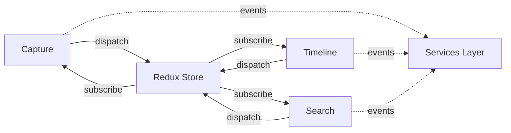

# Features Module - 功能模块

> 📍 **导航**: [根目录](../../CLAUDE.md) / [app](../CLAUDE.md) / [src](../CLAUDE.md) / **features/** | 更新时间: 2026-01-06

## 模块概述

Features 模块包含按业务领域划分的功能模块,每个子模块实现一个独立的用户功能。

### 设计原则
- 📦 按业务领域垂直切分
- 🔌 模块间松耦合
- 🎯 单一职责原则
- 🔄 通过 Redux Store 通信

## 子模块列表

### 1. Capture - 捕获记录模块
**路径**: `app/src/features/capture/`
**职责**: 多模态数据捕获(照片、文本、语音)

**核心组件**:
- `CaptureScreen.tsx` - 捕获主界面
- `AITagSuggestions.tsx` - AI 标签建议
- `useAITags.ts` - AI 标签 Hook

**依赖服务**:
- `@services/camera` - 相机服务
- `@services/ai` - AI 图像识别
- `@services/location` - 位置服务
- `@services/weather` - 天气服务

**Store Slice**: `entriesSlice`

---

### 2. Timeline - 时间线模块
**路径**: `app/src/features/timeline/`
**职责**: 时间轴展示和浏览历史记录

**核心组件**:
- `TimelineScreen.tsx` - 时间线主界面
- `TimelineItem.tsx` - 时间线条目
- `TimelineFilter.tsx` - 过滤器

**依赖服务**:
- `@services/storage` - 数据读取

**Store Slice**: `timelineSlice`

---

### 3. Search - 搜索模块
**路径**: `app/src/features/search/`
**职责**: 全文搜索和智能查询

**核心组件**:
- `SearchScreen.tsx` - 搜索界面
- `SearchResults.tsx` - 搜索结果
- `SearchFilters.tsx` - 搜索过滤

**依赖服务**:
- `@services/storage` - FTS5 全文搜索

**Store Slice**: `searchSlice`

**特性**:
- ✅ SQLite FTS5 全文索引
- ✅ 中文分词支持
- ✅ 模糊搜索
- ✅ 标签过滤

---

### 4. Settings - 设置模块
**路径**: `app/src/features/settings/`
**职责**: 应用配置和用户偏好

**核心组件**:
- `SettingsScreen.tsx` - 设置主界面
- `PrivacySettings.tsx` - 隐私设置
- `StorageSettings.tsx` - 存储设置

**依赖服务**:
- `@services/security` - 加密设置
- `@services/sync` - 同步配置

**Store Slice**: `settingsSlice`

---

### 5. Voice - 语音模块
**路径**: `app/src/features/voice/`
**职责**: 语音记录和播放

**核心组件**:
- `VoiceRecorder.tsx` - 录音界面
- `VoicePlayer.tsx` - 播放器

**依赖服务**:
- `@services/voice` - 音频录制

**Store Slice**: `entriesSlice`

---

### 6. Stats - 统计模块
**路径**: `app/src/features/stats/`
**职责**: 数据统计和可视化

**核心组件**:
- `StatsScreen.tsx` - 统计界面
- `StatsChart.tsx` - 图表组件

**依赖服务**:
- `@services/storage` - 数据聚合

**Store Slice**: 读取多个 slice

## 模块架构模式

每个 feature 模块通常包含:

```
feature-name/
├── index.ts              # 模块导出
├── screens/              # 页面组件
│   └── FeatureScreen.tsx
├── components/           # 子组件
│   ├── Component1.tsx
│   └── Component2.tsx
├── hooks/                # 自定义 Hooks
│   └── useFeature.ts
├── types.ts              # 类型定义
└── utils.ts              # 工具函数
```

## 功能模块间通信



### 通信规则
- ✅ 通过 Redux Store 共享状态
- ✅ 通过 Services 层访问数据
- ❌ 禁止直接调用其他 feature 的组件
- ❌ 禁止直接访问其他 feature 的内部状态

## 添加新功能模块

### 步骤

1. **创建目录结构**
```bash
mkdir -p app/src/features/new-feature/{screens,components,hooks}
touch app/src/features/new-feature/index.ts
```

2. **创建模块文档**
```bash
touch app/src/features/new-feature/CLAUDE.md
```

3. **实现功能组件**
```typescript
// screens/NewFeatureScreen.tsx
export const NewFeatureScreen = () => {
  const dispatch = useAppDispatch();
  // ... 实现
};
```

4. **创建 Store Slice**(如需要)
```typescript
// store/slices/newFeatureSlice.ts
export const newFeatureSlice = createSlice({...});
```

5. **注册路由**
```typescript
// app/navigation.tsx
<Stack.Screen name="NewFeature" component={NewFeatureScreen} />
```

## 最佳实践

### 状态管理
```typescript
// ✅ 推荐: 使用 Redux Toolkit
const dispatch = useAppDispatch();
const data = useAppSelector(state => state.feature.data);

// ❌ 避免: 组件内部状态用于跨组件数据
```

### 服务调用
```typescript
// ✅ 推荐: 在 useEffect 或事件处理中调用
useEffect(() => {
  storageService.loadData().then(data => {
    dispatch(setData(data));
  });
}, []);

// ❌ 避免: 在 render 中直接调用服务
```

### 类型安全
```typescript
// ✅ 推荐: 定义清晰的类型
interface FeatureProps {
  id: string;
  onComplete: (result: Result) => void;
}

// ❌ 避免: 使用 any
```

## 测试要求

每个 feature 模块应包含:
- 单元测试: 测试业务逻辑
- 集成测试: 测试与 Store 的交互
- UI 测试: 测试组件渲染

目标覆盖率: **≥ 70%**

## 相关文档

- [Services 服务层](../services/CLAUDE.md)
- [Store 状态管理](../store/CLAUDE.md)
- [UI 组件](../ui/CLAUDE.md)
- [编码规范](../../../agent_docs/04-coding-standards.md)
