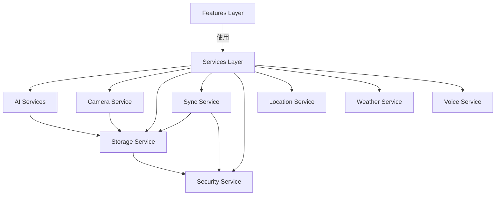

# Services Module - 服务层

> 📍 **导航**: [根目录](../../CLAUDE.md) / [app](../CLAUDE.md) / [src](../CLAUDE.md) / **services/** | 更新时间: 2026-01-06

## 模块概述

Services 模块提供底层技术能力,为 Features 层提供可复用的服务接口。

### 设计原则
- 🎯 单一职责,每个服务专注一个技术领域
- 🔌 接口导向,提供清晰的 API
- 🔒 数据安全,敏感操作加密保护
- ♻️ 可测试性,易于 Mock 和单元测试

## 服务列表

### 1. AI Services - AI 服务
**路径**: `app/src/services/ai/`
**职责**: AI 能力集成(图像识别、标签生成)

**核心文件**:
- `imageRecognition.ts` - 图像识别服务
- `tagGenerator.ts` - 智能标签生成

**主要接口**:
```typescript
// 图像识别
async function recognizeImage(imageUri: string): Promise<ImageAnalysis>

// 生成标签建议
async function generateTags(context: CaptureContext): Promise<string[]>
```

**依赖**:
- 外部 AI API(可配置)
- `@services/storage` - 缓存识别结果

---

### 2. Camera Service - 相机服务
**路径**: `app/src/services/camera/`
**职责**: 相机控制和照片捕获

**核心文件**:
- `cameraService.ts` - 相机服务主文件

**主要接口**:
```typescript
// 拍照
async function capturePhoto(options?: CameraOptions): Promise<PhotoResult>

// 检查权限
async function checkPermissions(): Promise<boolean>

// 请求权限
async function requestPermissions(): Promise<boolean>
```

**依赖**:
- React Native Camera API
- `@services/storage` - 保存照片

---

### 3. Storage Service - 存储服务
**路径**: `app/src/services/storage/`
**职责**: 本地数据存储和查询

**核心文件**:
- `database.ts` - SQLite 数据库封装
- `databaseService.ts` - 数据库操作服务

**主要接口**:
```typescript
// 初始化数据库
async function initDatabase(): Promise<void>

// CRUD 操作
async function createEntry(entry: Entry): Promise<string>
async function getEntry(id: string): Promise<Entry>
async function updateEntry(id: string, updates: Partial<Entry>): Promise<void>
async function deleteEntry(id: string): Promise<void>

// 查询
async function searchEntries(query: string): Promise<Entry[]>
async function getEntriesByDateRange(start: Date, end: Date): Promise<Entry[]>
```

**技术栈**:
- SQLite + FTS5 全文搜索
- 事务支持
- 索引优化

**数据表结构**:
```sql
-- 主表
CREATE TABLE entries (
  id TEXT PRIMARY KEY,
  content TEXT,
  tags TEXT,
  location TEXT,
  weather TEXT,
  created_at INTEGER,
  updated_at INTEGER
);

-- FTS5 全文索引
CREATE VIRTUAL TABLE entries_fts USING fts5(
  content, tags,
  content='entries',
  content_rowid='rowid'
);
```

---

### 4. Sync Service - 同步服务
**路径**: `app/src/services/sync/`
**职责**: 云端同步和备份

**核心文件**:
- `syncService.ts` - 同步服务主文件

**主要接口**:
```typescript
// 同步到云端
async function syncToCloud(): Promise<SyncResult>

// 从云端恢复
async function restoreFromCloud(): Promise<RestoreResult>

// 同步状态
function getSyncStatus(): SyncStatus
```

**同步策略**:
- 增量同步
- 冲突解决
- 离线队列

---

### 5. Security Service - 安全服务
**路径**: `app/src/services/security/`
**职责**: 数据加密和安全保护

**核心文件**:
- `encryption.ts` - 加密/解密服务

**主要接口**:
```typescript
// 加密数据
async function encrypt(data: string, key: string): Promise<string>

// 解密数据
async function decrypt(encryptedData: string, key: string): Promise<string>

// 生成密钥
async function generateKey(): Promise<string>
```

**加密算法**:
- AES-256-GCM
- PBKDF2 密钥派生

---

### 6. Location Service - 位置服务
**路径**: `app/src/services/location/`
**职责**: 地理位置获取

**核心文件**:
- `locationService.ts` - 位置服务主文件

**主要接口**:
```typescript
// 获取当前位置
async function getCurrentLocation(): Promise<Location>

// 反向地理编码
async function reverseGeocode(lat: number, lon: number): Promise<Address>
```

---

### 7. Weather Service - 天气服务
**路径**: `app/src/services/weather/`
**职责**: 天气信息获取

**核心文件**:
- `weatherService.ts` - 天气服务主文件

**主要接口**:
```typescript
// 获取当前天气
async function getCurrentWeather(location: Location): Promise<Weather>

// 获取天气预报
async function getForecast(location: Location, days: number): Promise<Weather[]>
```

---

### 8. Voice Service - 语音服务
**路径**: `app/src/services/voice/`
**职责**: 音频录制和播放

**核心文件**:
- `audioRecorder.ts` - 音频录制服务

**主要接口**:
```typescript
// 开始录音
async function startRecording(): Promise<void>

// 停止录音
async function stopRecording(): Promise<AudioResult>

// 播放音频
async function playAudio(uri: string): Promise<void>
```

## 服务层架构



## 服务使用规范

### 在 Features 中使用服务

```typescript
// ✅ 推荐: 在 useEffect 或事件处理中调用
import { storageService } from '@services/storage';

const MyComponent = () => {
  useEffect(() => {
    const loadData = async () => {
      try {
        const data = await storageService.getEntries();
        // ... 处理数据
      } catch (error) {
        console.error('加载失败:', error);
      }
    };
    loadData();
  }, []);
};

// ❌ 避免: 在 render 中直接调用
const MyComponent = () => {
  const data = storageService.getEntries(); // 错误!
};
```

### 错误处理

```typescript
// ✅ 推荐: 统一错误处理
try {
  await storageService.createEntry(entry);
} catch (error) {
  if (error instanceof StorageError) {
    // 处理存储错误
  } else {
    // 处理其他错误
  }
}
```

### 服务初始化

```typescript
// App.tsx 中初始化服务
useEffect(() => {
  const initServices = async () => {
    await storageService.initDatabase();
    await syncService.initialize();
  };
  initServices();
}, []);
```

## 添加新服务

### 步骤

1. **创建服务目录**
```bash
mkdir app/src/services/new-service
```

2. **实现服务接口**
```typescript
// app/src/services/new-service/newService.ts
class NewService {
  async initialize(): Promise<void> {
    // 初始化逻辑
  }

  async doSomething(): Promise<Result> {
    // 业务逻辑
  }
}

export const newService = new NewService();
```

3. **添加类型定义**
```typescript
// app/src/services/new-service/types.ts
export interface NewServiceOptions {
  // ...
}

export interface NewServiceResult {
  // ...
}
```

4. **编写单元测试**
```typescript
// app/src/services/new-service/__tests__/newService.test.ts
describe('NewService', () => {
  it('should do something', async () => {
    // ... 测试代码
  });
});
```

5. **导出服务**
```typescript
// app/src/services/index.ts
export { newService } from './new-service/newService';
```

## 服务测试

### Mock 服务

```typescript
// 在测试中 Mock 服务
jest.mock('@services/storage', () => ({
  storageService: {
    getEntries: jest.fn().mockResolvedValue([]),
    createEntry: jest.fn().mockResolvedValue('id'),
  },
}));
```

### 集成测试

```typescript
// 测试服务间交互
describe('AI Service Integration', () => {
  it('should save recognition results to storage', async () => {
    const result = await aiService.recognizeImage(testImage);
    expect(storageService.createEntry).toHaveBeenCalledWith(
      expect.objectContaining({ tags: result.tags })
    );
  });
});
```

## 性能优化

### 缓存策略
- 图像识别结果缓存 24 小时
- 位置信息缓存 5 分钟
- 天气数据缓存 1 小时

### 批处理
```typescript
// ✅ 推荐: 批量操作
await storageService.batchCreateEntries(entries);

// ❌ 避免: 循环单次操作
for (const entry of entries) {
  await storageService.createEntry(entry); // 性能差
}
```

## 安全注意事项

1. **敏感数据加密**: 所有用户数据通过 Security Service 加密
2. **权限检查**: 使用系统资源前先检查权限
3. **输入验证**: 验证所有外部输入
4. **错误信息**: 不暴露内部实现细节

## 相关文档

- [Features 功能模块](../features/CLAUDE.md)
- [Store 状态管理](../store/CLAUDE.md)
- [安全隐私政策](../../../agent_docs/07-security-privacy.md)
